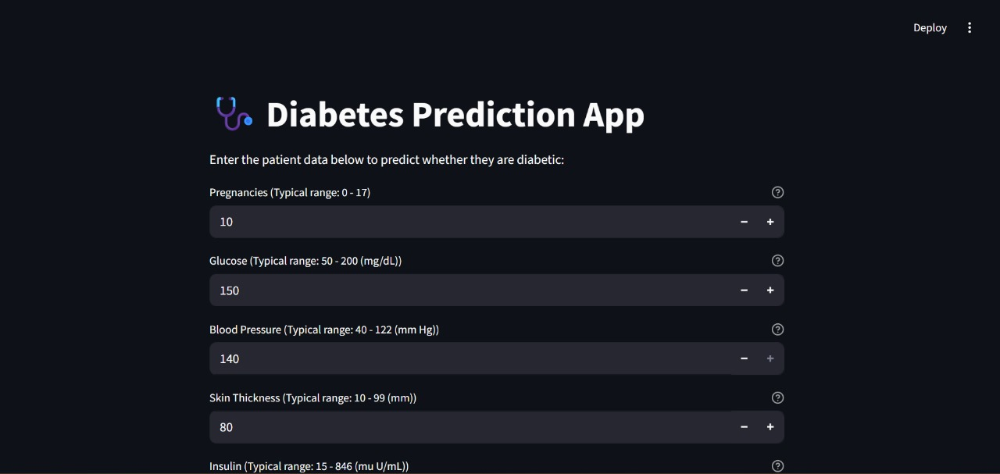
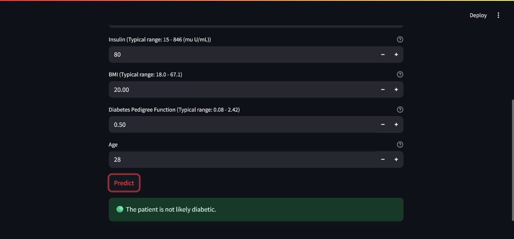

<h1>🩺 Diabetes Prediction App</h1>

A simple and interactive web app built with Streamlit to predict whether a person is diabetic based on medical input features. It uses a machine learning model trained on the <strong>Pima Indians Diabetes Dataset</strong>.

<h2>🚀 Features</h2>
<ul>
  <li>Takes 8 health-related inputs such as Glucose, BMI, Age, etc.</li>
  <li>Predicts diabetes likelihood using a trained ML model.</li>
  <li>Intuitive and clean Streamlit user interface.</li>
  <li>Real-time prediction at the click of a button.</li>
</ul>

<h2>🧠 Model Info</h2>
<ul>
  <li>Model used: <em>[Random Forest]</em></li>
  <li>Trained on the Pima Indians Diabetes Dataset.</li>
  <li>Saved as: <code>diabetes_model_tuned.pkl</code> using <code>joblib</code>.</li>
</ul>

<h2>📦 Installation</h2>
<ol>
  <li>Clone the repository:
    <pre><code>git clone https://github.com/yourusername/diabetes-prediction-app.git
cd diabetes-prediction-app</code></pre>
  </li>
  <li>Create a virtual environment (optional but recommended):
    <pre><code>python -m venv venv
source venv/bin/activate  # On Windows use `venv\Scripts\activate`</code></pre>
  </li>
  <li>Install dependencies:
    <pre><code>pip install -r requirements.txt</code></pre>
  </li>
  <li>Run the app:
    <pre><code>streamlit run app.py</code></pre>
  </li>
</ol>

<h2>🖼️ Screenshot</h2>

<h2>🛠️ Tech Stack</h2>
<ul>
  <li>Python 🐍</li>
  <li>Streamlit 📊</li>
  <li>Scikit-learn 🤖</li>
  <li>Joblib 🗂️</li>
  <li>Pandas &amp; NumPy 📚</li>
</ul>

<h2>📁 File Structure</h2>
<pre><code>├── app.py                   # Main Streamlit app
├── diabetes_model_tuned.pkl # Trained ML model
├── requirements.txt         # Required Python packages
└── README.md                # This file
</code></pre>

<h2>📄 License</h2>

<a href="LICENSE">MIT License</a>

<h2>👤 Author</h2>

Your Name – <a href="https://github.com/SreedeepGhosh">Sreedeep Ghosh</a>

<em>Disclaimer: This app is a fun project for educational/demo purposes and strictly not intended for medical diagnosis.</em>

